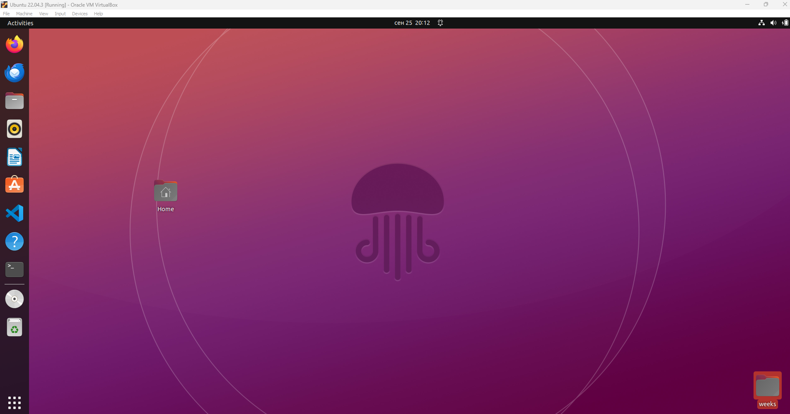
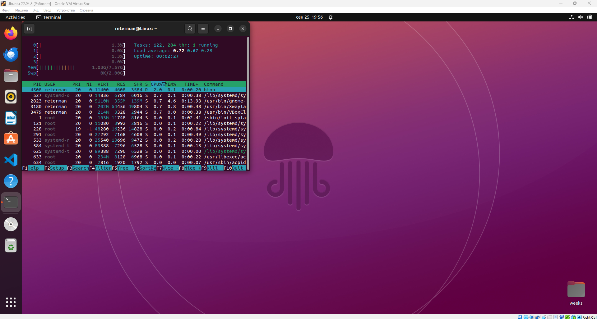
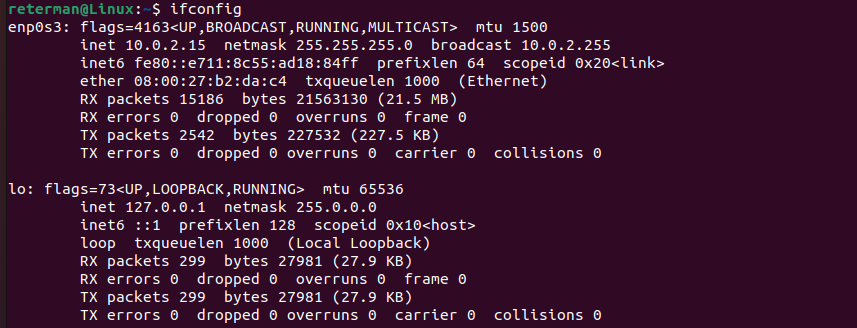
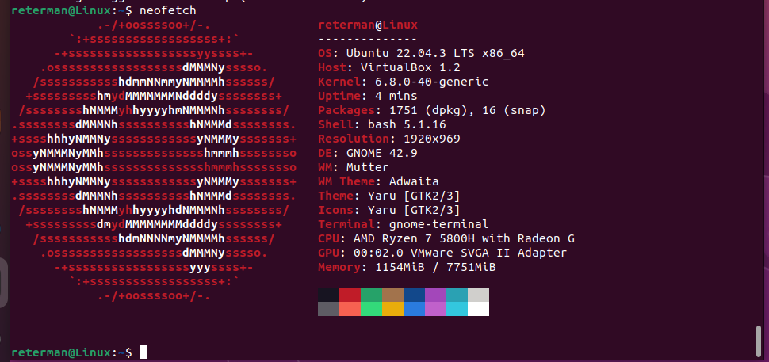

# Lab Report

## Task 1: VM Deployment

### 1.1 Installation of VirtualBox
- **Version of VirtualBox:** 7.0.10 r158379 (Qt5.15.2)

### 1.2 Deployment of a Virtual Machine
- **Steps to Deploy the VM:**
  1. Open VirtualBox.
  2. Click on "New" to create a new VM.
  3. Name the VM "Ubuntu VM" and select:
     - **Type:** Linux
     - **Version:** Ubuntu (64-bit)
  4. Base Memory – **8000 MB**.
  5. Processors – **4**.
  8. Start the VM and follow the installation instructions for Ubuntu.

### 1.3 Screenshot of the Running VM

---

## Task 2: System Information Tools

### 2.1 Processor, RAM, and Network Information
- **Tool Used:** `htop`
  - **Command Used:** `htop`
  - **Output:**

- **Tool Used:** `ifconfig`
  - **Command Used:** `ifconfig`
  - **Output:**

### 2.2 Operating System Specifications
- **Tool Used:** `neofetch`
  - **Command Used:** `neofetch`
  - **Output:**

